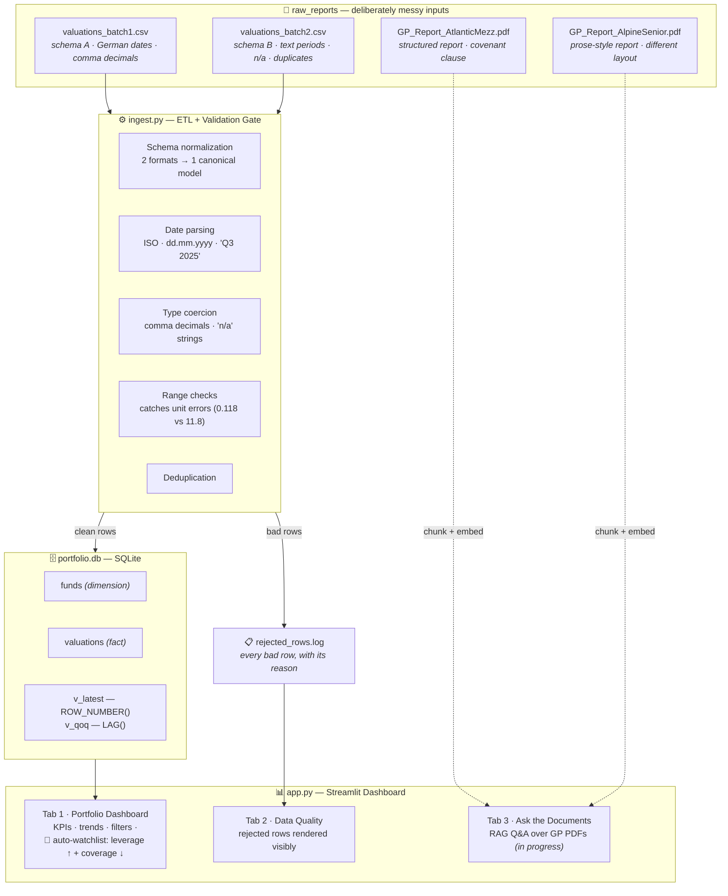

# 🔍 CreditLens

**Private Credit Portfolio Monitor** — an end-to-end prototype that ingests messy
GP (General Partner) quarterly reports, validates and normalizes the data, and
monitors portfolio health on an interactive dashboard.

Built by [Srikar Kodi](https://srikarkodi.dev) · [LinkedIn](https://linkedin.com/in/srikar-kodi-046a631b2)

> **Why this exists:** In private credit fund-of-funds investing, every GP reports
> the same metrics (NAV, yield, leverage, coverage, defaults) in different formats —
> different schemas, different date conventions, different units. Before anyone can
> trust a dashboard, someone has to make the data trustworthy. CreditLens is a
> working miniature of that pipeline.

---

## Architecture

## Design decisions (and honest limitations)

- **Synthetic data, deliberately ugly.** Real GP reports are confidential. The
  generator plants realistic flaws on purpose — inconsistent schemas, EU date/decimal
  conventions, unit errors, duplicates, a missing quarter — so the validation gate
  has something real to catch.
- **One planted story:** fund F003 deteriorates across four quarters (leverage
  4.2x → 5.4x while coverage falls 2.8x → 1.6x, against a 5.5x covenant). The
  watchlist rule catches it automatically — that's the point of a monitoring
  dashboard.
- **SQLite, not Postgres/SQL Server.** Right choice for a self-contained prototype;
  the schema and window-function views port directly to a production RDBMS.
- **Streamlit, not Power BI.** Same data model and dashboard thinking; in a
  Microsoft-stack environment this would be a Power BI report over the same star
  schema.
- **Repair vs. reject:** fixable issues (date formats, comma decimals) are
  normalized and loaded; unfixable ones (missing values, out-of-range numbers) are
  rejected *visibly* — never silently corrected, never silently dropped.

## What production would add

Airflow-scheduled ingestion · Postgres/Azure SQL · Azure OpenAI (in-tenant) for the
RAG layer · human-in-the-loop validation workflow for AI-extracted figures ·
authentication & audit logging.

---

*The guiding principle: a pipeline is only as good as the trust people can put in
its output.*